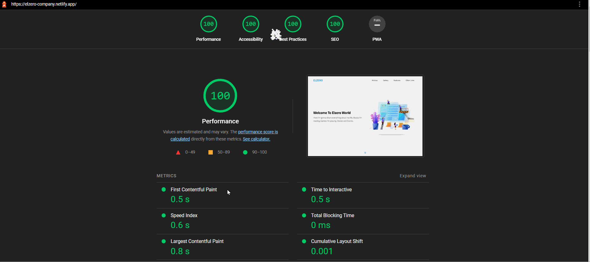

# Elzero Company Website

   

## Live Website

💻 Check the live website from [here](https://elzero-company.netlify.app/)

## Design Previews

| Desktop Preview | Mobile Preview |
| --------------- | -------------- |
| [Desktop Preview](.github/preview-desktop.png) | [Mobile Preview](.github/preview-mobile.png) |

## Lighthouse Results

## Implemented Features

- ⭐ Single Page Website
- 🤖 Responsive layout on ALL devices
- ⚡ Fast and lightweight website; based on Lighthouse report
- 🖥️ Active Section Indicator
- 🌟 Clients rating animation
- 📊 Skill bars animation
- ⏰ Countdown event date
- 🌱 Smooth scrolling behavior
- ✨ And more!

## Used Technologies

<table>
  <tr>
    <td>
      
    </td>
    <td>
      
    </td>
    <td>
      
    </td>
    <td>
      
    </td>
  </tr>
</table>

## Credits & Assets

- Website Image Preview Template is from [ElZero Web School](https://elzero.org/)
- Images are from [Unsplash](https://unsplash.com/)
- Font Icons are from [Font Awesome](https://fontawesome.com/)
- Fonts are from [Google Fonts](https://fonts.google.com/)
